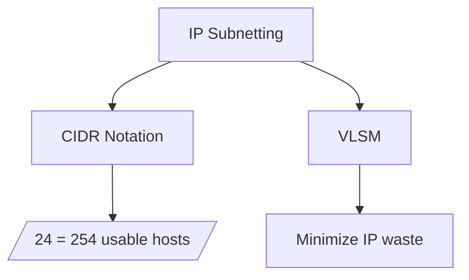
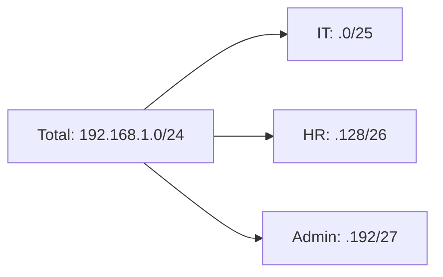
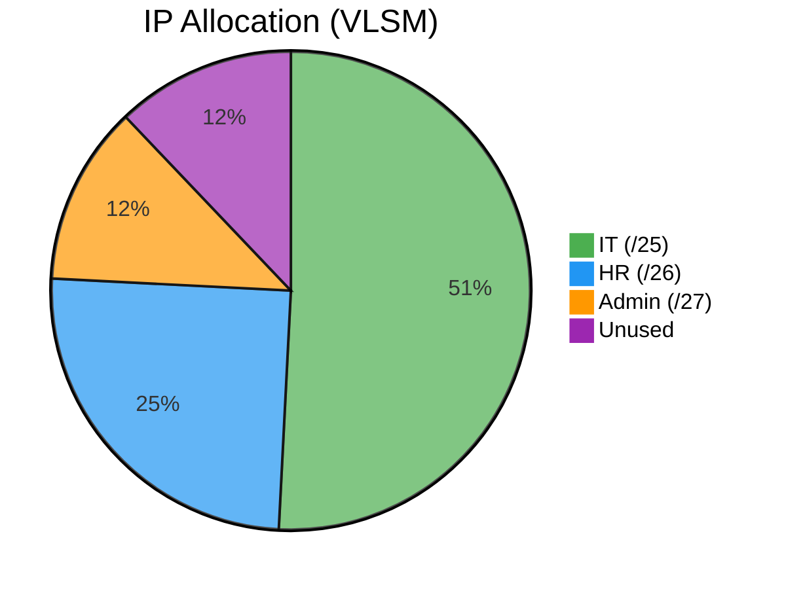
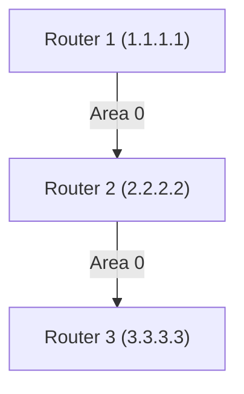

---
tags:
  - "#networking"
  - "#subnet"
  - "#vlsm"
  - "#vlan"
  - ospf
  - os10
---

# Subnet Mask & VLSM Notes


## **Subnet Mask Basics**
### CIDR Notation
- Shorthand for subnet masks using `/` format
- Formula:  
  **Usable Hosts = 2<sup>(32-CIDR)</sup> - 2**  
  (Subtract 2 for network and broadcast addresses)

### Example: /24 Subnet
```
IP Range:     192.168.1.0/24
Network:      192.168.1.0
Usable Hosts: 192.168.1.1 - 192.168.1.254
Broadcast:    192.168.1.255
Calculation:  2^(32-24) - 2 = 254 hosts
```


## **VLSM Implementation Guide**

### Step-by-Step Process

1. **List requirements** ↓ (Largest to smallest)
    
2. **Calculate minimum subnet size**
    
3. **Allocate sequentially** → No overlaps!

Example:
IT needs 120 hosts
HR needs 60 hosts
Admin needs 28 hosts

Allocate like this:
```
"IT Dept (/25)" : 126 usable hosts
"HR Dept (/26)" : 62 usable hosts
"Admin (/27)" : 30 usable hosts
"Unused" : 30 usable hosts (remainder)
```

## 🗂️ Subnetting Quick Reference

| Concept         | Formula/CIDR      | Example                      | Visual Guide                  |
|-----------------|-------------------|------------------------------|-------------------------------|
| **CIDR Basics** | `2^(32-CIDR) - 2` | `/24 → 254 hosts`            | `![[cidr-scale]]`             |
| **/24 Subnet**  | 255.255.255.0     | `192.168.1.1-254`            | `![[subnet-24]]`              |
| **VLSM Allocation** |               |                              |                               |
| ▶ IT (/25)      | 126 hosts         | `192.168.1.0/25`             | `![[vlms-it]]`                |
| ▶ HR (/26)      | 62 hosts          | `192.168.1.128/26`           | `![[vlsm-hr]]`                |
| ▶ Admin (/27)   | 30 hosts          | `192.168.1.192/27`           | `![[vlsm-admin]]`             |
## 🌐 Subnet Allocation Table



| Allocation   | CIDR | Usable Range         | Hosts | Notes                  |
| ------------ | ---- | -------------------- | ----- | ---------------------- |
| **IT**       | /25  | `192.168.1.1-.126`   | 126   | `[[Priority Devices]]` |
| **HR**       | /26  | `192.168.1.129-.190` | 62    | `[[BYOD Policy]]`      |
| **Admin**    | /27  | `192.168.1.193-.222` | 30    | `[[Secure VLAN]]`      |
| **Reserved** | /27  | `192.168.1.225-.254` | 30    | `[[Future Expansion]]` |




# Configuring VLAN and OSPF using Dell OS10
## 🖧 DELL OS10 VLAN Configuration (for Obsidian)

### 📋 Basic Steps Overview

1. **Enter Configuration Mode**
2. **Create the VLAN**
3. **Assign VLAN to Interfaces**
4. **(Optional) Set VLAN Interface IP**
5. **Save Configuration**

### 🛠 Commands

### 1. Enter Configuration Mode
```
configure terminal
```
### 2. Create VLAN
```
vlan 20
name IT_Department
exit
```
### 3. Assign VLAN to an interface
```
interface ethernet1/1/2
switchport mode access
switchport access vlan 20
exit
```
### 4. (Optional) Assign IP to VLAN Interface
```
interface vlan 20
ip address 192.168.20.1 255.255.255.0
no shutdown
exit
```
### 5. Save Config
```
write memory
```
or
```
copy running-configuration startup-configuration
```
### 🧠 Notes

- **Access Mode**: Each port belongs to only one VLAN.
- **Trunk Mode** (optional): If you need to allow multiple VLANs over one port:
```
interface ethernet1/1/10
switchport mode trunk
switchport trunk allowed vlan 10,20,30
exit
```
- **Layer 3 Routing**: If you create SVIs, the switch can route between VLANs if routing is enabled.

## 🛰️ OSPF Configuration — DELL OS10

### 📘 Overview

**OSPF (Open Shortest Path First)** is a dynamic routing protocol that uses link-state information to build a map of the network. It's often used in larger enterprise networks.
### 🔧 Basic OSPF Configuration Steps

1. Enable routing.
2. Enter OSPF router config mode.
3. Set router ID (recommended).
4. Define OSPF network(s).
5. (Optional) Configure passive interfaces.
6. Save the configuration.

### 🛠️ Step-by-Step Configuration

### 1. Enable Routing Globally
```
configure terminal
ip routing
exit
```
### 2. Configure OSPF router
```
configure terminal
router ospf
router-id <ROUTER-ID> (example router-id 1.1.1.1)
exit
```
### 3. Add Networks to OSPF
```
router ospf
network <NETWORK> <WILDCARD_MASK> area <AREA_ID>
exit
```
example:
```
router ospf
network 10.0.0.0 0.0.0.255 area 0
exit
```
### 4. (Optional) Make Interfaces Passive
To prevent OSPF hellos on certain interfaces:
```
router ospf
passive-interface <INTERFACE_NAME>
exit
```
example:
```
router ospf
passive-interface gi 1/0/1
exit
```
### 5. Save configuration
```
write memory
```
or
```
copy running-configuration startup-configuration
```


